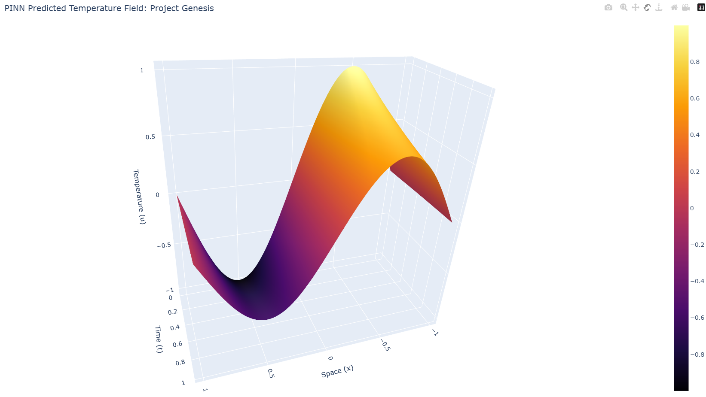

# Project Genesis: Fabric Report

## Overview: Physics-Informed Neural Networks (PINNs)

In this project, I implemented a PINN to solve the 1D Heat Equation without a classical grid. By leveraging JAX's Automatic Differentiation, the PDE residual is embedded directly into the neural network's loss landscape.

### 1. The Differentiable Fabric (Interactive 3D)

The following link leads to the interactive 3D surface plot of the predicted temperature field. This visualization shows how the initial sine wave smoothly diffuses towards a flat state over time.

👉 **[Interactive 3D Physics Simulation (pinn_3d_fabric.html)](../data/pinn_3d_fabric.html)**
*(Note: Download the file and open it in a browser to rotate and explore the manifold.)*

---

### 2. From PINNs to Operators: Fourier Neural Operators (FNOs)

While our PINN is highly accurate for a specific case, FNOs represent the next level of scientific AI. Here is how they differ:

*   **Operator Mapping:** Unlike PINNs, which approximate a single solution, FNOs learn the operator itself, mapping entire functional spaces (initial conditions) to solution spaces.
*   **Spectral Convolutions:** By performing convolutions in the frequency domain (via FFT), FNOs capture global patterns and are invariant to the resolution of the grid.
*   **Zero-Shot Inference:** A trained FNO can predict the evolution of a PDE for entirely new initial conditions in a single forward pass, whereas a PINN would require retraining from scratch.

---

### 3. Progress Summary (Week 5)

*   [x] Mesh-free data generation with JAX.
*   [x] Stateless MLP architecture with Flax.
*   [x] Physics loss embedding via nested `jax.grad`.
*   [x] High-performance training on GPU (XLA optimized).
*   [x] Interactive 3D visualization with Plotly.

*Your Oracle now understands thermodynamics. The fabric of reality is yours to mold.*
