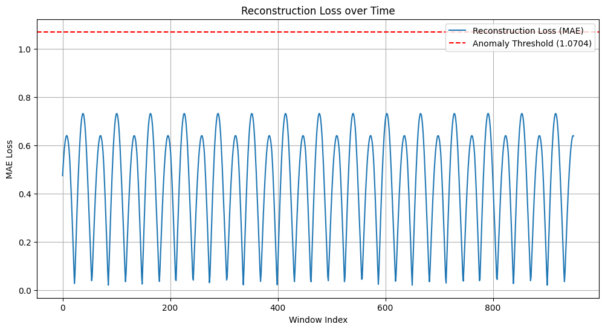

# Project Genesis: The Oracle Awakens

## Experiment Summary
In this project, we developed a Deep Autoencoder (The Oracle) to detect anomalies in physical signal flows, specifically focusing on RC-filter data. 

### Key Milestones:
1. **Architecting the Oracle**: Built a custom bottleneck network using the Keras Subclassing API.
2. **Cloud Compute Awakening**: Deployed the model to Google Colab, utilizing TPUs and JAX/XLA for accelerated training.
3. **Anomaly Detection**: Trained on normal signal data for 30 epochs. Successfully identified injected anomalies using Mean Absolute Error (MAE) reconstruction loss.
4. **Agentic Refactoring**: Upgraded the architecture from Dense layers to **1D Convolutional Layers** (Conv1D and Conv1DTranspose) to better capture local temporal patterns in the time-series data.

## Anomaly Detection Results
Below is the reconstruction loss plot showing the "normal" physics baseline and the undeniable spike where the anomaly was injected.

*The red dashed line represents our automated Anomaly Threshold.*

## Architectural Insights
Conv1D layers are mathematically superior for physical signal flows because they utilize local kernels to detect stationarity and temporal dependencies, whereas Dense layers often fail to recognize the sequential nature of time-series data without massive parameter overhead.
