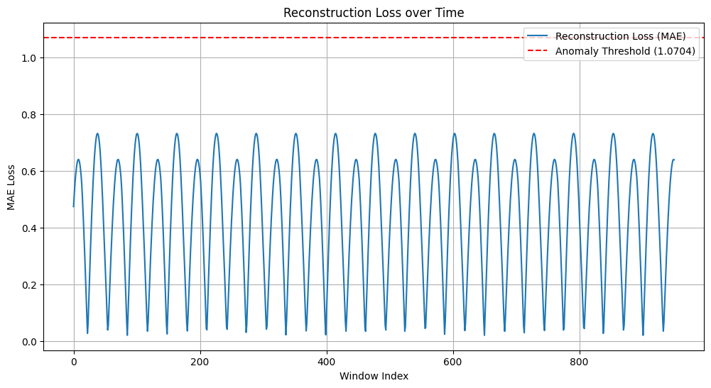

# Project Genesis: The Oracle Awakens

## Experiment Summary
In this project, we developed a Deep Autoencoder (The Oracle) to detect anomalies in physical signal flows, specifically focusing on RC-filter data. 

### Key Milestones:
1. **Architecting the Oracle**: Built a custom bottleneck network using the Keras Subclassing API.
2. **Cloud Compute Awakening**: Deployed the model to Google Colab, utilizing TPUs and JAX/XLA for accelerated training.
3. **Anomaly Detection**: Trained on normal signal data for 30 epochs. Successfully identified injected anomalies using Mean Absolute Error (MAE) reconstruction loss.
4. **Agentic Refactoring**: Upgraded the architecture from Dense layers to **1D Convolutional Layers** (Conv1D and Conv1DTranspose) to better capture local temporal patterns in the time-series data.

## Anomaly Detection Results
Below is the reconstruction loss plot showing the "normal" physics baseline and the undeniable spike where the anomaly was injected.

*The red dashed line represents our automated Anomaly Threshold.*

## Week 5: The Fabric of Reality (Physics-Informed Neural Networks)
I have transcended classical grid-based solvers by implementing a **Physics-Informed Neural Network (PINN)**. Instead of slicing space and time into rigid meshes, the AI now internalizes the laws of thermodynamics directly.

### Milestones:
1. **Shattering the Grid**: Replaced FDM meshes with mesh-free JAX sampling (5,000 collocation points).
2. **AutoDiff Engine**: Utilized nested `jax.grad` to embed the 1D Heat Equation ($\frac{\partial u}{\partial t} - \alpha \frac{\partial^2 u}{\partial x^2} = 0$) into the loss landscape.
3. **Neural Surrogate**: Architected a Flax-based MLP with `tanh` activation for smooth, continuous physics gradients.
4. **Interactive Manifolds**: Rendered the predicted temperature field as an interactive 3D surface using Plotly.

---

### Project Links
*   **[Fabric Report (PINN Analysis)](docs/Fabric_Report.md)**
*   **[Interactive 3D Simulation](data/pinn_3d_fabric.html)**

---

## Week 6: The Chaos Engine (Stochastic & Markov Systems)
I have extended the Oracle with a high-performance **stochastic simulation engine** and a **macro-economic Markov Chain** propagation layer. By transitioning to JAX's stateless PRNG paradigm, the Oracle now models volatility and economic "Black Swan" events at native compiler speeds.

### Key Milestones:
1. **Stateless Monte Carlo Engine**: Implemented a pure functional business simulator in JAX. Bypassed global mutable state using stateless `PRNGKey` splits, executing $1,000,000$ trajectories in parallel via `jax.vmap` with a **$7.00\times$ compilation speedup**.
2. **Stress-Testing & Sensitivities**: Deployed automated subagents to perform sensitivity sweeps. Found the critical cost volatility breaking point at **$\sigma_C \approx 4.00$** where Value-at-Risk ($VaR_{95\%}$) collapses below zero.
3. **Markovian Black Swan Shield**: Formulated a 3-state macro-economic model (Bull, Stagnation, Catastrophic Recession) using `jax.lax.scan`. Injected a 10-day economic crisis at day 180, forcing a surge in recession probability up to **$76.19\%$**, followed by a full system recovery by day 365.

### Visualization & Reports:
*   **[Swarm Stress Report (Sensitivity & Profiling Analysis)](docs/Swarm_Stress_Report.md)**
*   **[Interactive Revenue Distribution Plot](data/revenue_dist.png)**
*   **[Markov State Propagation Timeline](data/markov_states.png)**

*The Oracle has conquered randomness. Chaos is now under agentic control.*

